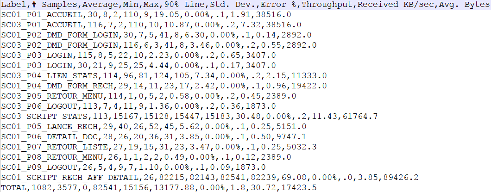
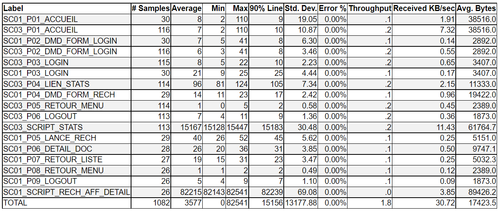

# Generating an HTML table from a csv file
This program reads a csv file and generates an html table div block (not a complet html page)

Reads a csv file and generates an html div block as an html table with an embedded stylesheet.

The first column is left-aligned, the other columns right-aligned

Odd lines are gray, even lines are white

The input csv file comes from a "Save Table Data"" of a **JMeter Report** (Synthesis Report, Aggregate Report, Summary Report) or from jmeter-graph-tool-maven-plugin

If you want to sort the array then add a third argument : sort 

The array will be sorted except the first line (headers) and the last line (footer TOTAL). The sorting is done on the Label (First column).

The generated HTML table can be directly included in an HTML page with the GenereHtmlForDirectory tool.

## License
See the LICENSE file Apache 2 [https://www.apache.org/licenses/LICENSE-2.0](https://www.apache.org/licenses/LICENSE-2.0)

## Html table generated
Some table generated with this plugin

The synthesis csv file **input** first argument


The html table **output** second argument



## Usage maven

The maven groupId, artifactId and version, this plugin is in the **Maven Central Repository**

```xml
<groupId>io.github.vdaburon</groupId>
<artifactId>csv-report-to-html</artifactId>
<version>1.1</version>
```
Just include the plugin in your `pom.xml` and execute `mvn verify`.

```xml
<project>
    <!-- ... -->
    <dependencies>
        <dependency>
            <groupId>io.github.vdaburon</groupId>
            <artifactId>csv-report-to-html</artifactId>
            <version>1.1</version>
        </dependency>
    </dependencies>
    
    <build>
        <plugins>
            <plugin>
                <groupId>org.codehaus.mojo</groupId>
                <artifactId>exec-maven-plugin</artifactId>
                <version>1.2.1</version>
                <executions>
                    <execution>
                        <id>aggregate_csv_to_html</id>
                        <phase>verify</phase>
                        <goals>
                            <goal>java</goal>
                        </goals>
                        <configuration>
                            <mainClass>io.github.vdaburon.jmeter.utils.ReportCsv2Html</mainClass>
                            <arguments>
                                <argument>${project.build.directory}/jmeter/results/AggregateReport.csv</argument>
                                <argument>${project.build.directory}/jmeter/results/AggregateReport.html</argument>
                                <argument>sort</argument>
                            </arguments>
                        </configuration>
                    </execution>
                    <execution>
                        <id>synthesis_csv_to_html</id>
                        <phase>verify</phase>
                        <goals>
                            <goal>java</goal>
                        </goals>
                        <configuration>
                            <mainClass>io.github.vdaburon.jmeter.utils.ReportCsv2Html</mainClass>
                            <arguments>
                                <argument>${project.build.directory}/jmeter/results/SynthesisReport.csv</argument>
                                <argument>${project.build.directory}/jmeter/results/SynthesisReport.html</argument>
                                <argument>sort</argument>
                            </arguments>
                        </configuration>
                    </execution>
                </executions>
            </plugin>
        </plugins>
    </build>
</project>
```

## Simple jar tool
This tool is a java jar, so it's could be use as simple jar (look at [Release](https://github.com/vdaburon/JMReportCsvToHtml/releases) to download jar file)

Need also commons-csv.jar librarie

https://commons.apache.org/proper/commons-csv/download_csv.cgi

The third parameter "sort" is optional. The sorting is done on the Label (First column)
<pre>
java -cp csv-report-to-html-&lt;version&gt;.jar;commons-csv-&lt;version&gt;.jar io.github.vdaburon.jmeter.utils.ReportCsv2Html AggregateReport.csv AggregateReport.html sort
</pre>

## Link to others projects
Usally this plugin is use with [jmeter-graph-tool-maven-plugin](https://github.com/vdaburon/jmeter-graph-tool-maven-plugin)

The **jmeter-graph-tool-maven-plugin** create the report csv file and **this plugin** create the **html table report** from the csv file.

And an html page to display all graphs and html report tables could be generated whith [create-html-for-files-in-directory](https://github.com/vdaburon/CreateHtmlForFilesInDirectory)

